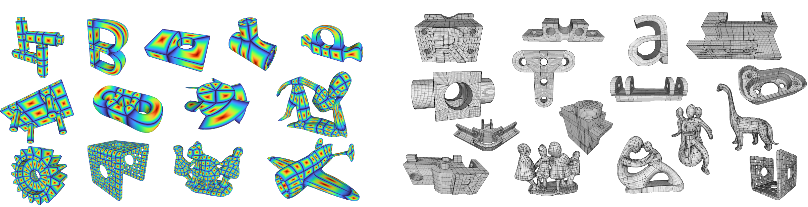

<div align="center">

<h1>SQuadGen: Generating Simple Quad Layouts via Chart Distance Fields</h1>

<p>
<a href="https://youkang-kong.github.io/squadgen/"></a>
<a href="https://arxiv.org/abs/2604.27329"></a>
<a href="https://github.com/microsoft/SQuadGen"></a>
<a href="https://huggingface.co/microsoft/SQuadGen"></a>
<a href="LICENSE"></a>
</p>

<p>
  <a href="https://Youkang-Kong.github.io/">Youkang Kong</a><sup>1,2</sup>,
  <a href="https://xueyuhanlang.github.io/">Yang Liu</a><sup>2</sup>,
  <a href="https://yuedong.shading.me/">Yue Dong</a><sup>2</sup>,
  <a href="https://scholar.google.com/citations?user=P91a-UQAAAAJ">Xin Tong</a><sup>2</sup>,
  <a href="https://scholar.google.com/citations?user=9akH-n8AAAAJ&hl=en">Heung-Yeung Shum</a><sup>2</sup>
</p>

<p><sup>1</sup>Tsinghua University    <sup>2</sup>Microsoft Research Asia</p>



<p><em>SQuadGen synthesizes simple quad layouts on 3D shapes by learning quad layout patterns in the Chart Distance Field representation. Left: synthesized CDFs across diverse shapes. Right: generated quad meshes with simple layouts, with complex chart boundaries highlighted by thicker lines.</em></p>

</div>

**SQuadGen** is a diffusion-based generative framework for synthesizing simple quad layouts on 3D shapes. It introduces **Chart Distance Fields (CDF)**, a continuous surface-based representation that makes quad layout generation amenable to neural learning while preserving structure useful for downstream modeling and editing.

This release covers the main SQuadGen workflow: CDF data preparation, Geom-AE and SQ-VAE reconstruction, SQ-Diffuse inference and training, and loop simplicity evaluation.

## ✨ Highlights

### 1. Chart Distance Fields

CDF and DCDF encode chart centers, boundaries, and flow directions as continuous scalar fields on the surface, bypassing direct prediction of discrete quad connectivity.

### 2. Loop Simplicity Metrics

Loop-aware scores evaluate whether face-loops and edge-loops stay simple, making layout quality measurable in terms of editability rather than geometry error alone.

### 3. Generative Topology Prior

The model learns topology patterns from artist-authored and recovered quad layouts, capturing human priors for where clean loops and charts should appear. See [data preparation](data_tools/README.md) and the [paper](https://arxiv.org/abs/2604.27329) for details.

### 4. Loop-Aware Data Curation

A recovery pipeline and simplicity metrics curate 230k high-quality quad layouts, filtering for editability instead of only geometric reconstruction accuracy. The curation process and dataset scope are described in [data preparation](data_tools/README.md) and the [paper](https://arxiv.org/abs/2604.27329).

## 🗺️ Roadmap

- [x] Paper release
- [x] Release pretrained checkpoints
- [x] Release inference and training code
- [x] Release training dataset
- [ ] Release data preprocess code
- [ ] Release quad extraction code

## 🛠️ Installation

### Prerequisites

- **System**: Linux.
- **Software**: [Conda](https://docs.anaconda.com/miniconda/install/) for environment management.
- **Dependencies**: CUDA `>=13.0` and CUDA-capable PyTorch `>=2.9.1` for practical training and inference.

### Installation Steps

1. Clone the repo with submodules:

```sh
git clone --recurse-submodules https://github.com/microsoft/SQuadGen.git SQuadGen
cd SQuadGen
```

If you already cloned the repository without submodules, run:

```sh
git submodule update --init --recursive
```

2. Create and activate the conda environment:

```sh
conda create -n squadgen python=3.10
conda activate squadgen
```

3. Install PyTorch and SQuadGen:

```sh
pip install torch==2.9.1 torchvision==0.24.1 torchaudio==2.9.1 --index-url https://download.pytorch.org/whl/cu130
python -c "import torch; print(torch.__version__)"
sh setup.sh
```

The command above installs the CUDA 13.0 PyTorch wheels. If you use a different CUDA version, choose the matching PyTorch install command from the [official PyTorch instructions](https://pytorch.org/get-started/locally/), and make sure the installed version is `>=2.9.1`.

4. Install [DualMesh-UDF](https://github.com/cong-yi/DualMesh-UDF) (required for Geometry AE mesh extraction):

```sh
pip install -e DualMesh-UDF
```

See [DualMesh-UDF/README.md](DualMesh-UDF/README.md) for details.

5. Build [QuadTools](https://github.com/xueyuhanlang/QuadTools4SquadGen) (required for training-data generation, quad mesh extraction, loop simplicity evaluation, etc.):

```sh
cd QuadTools
mkdir -p build && cd build
cmake .. -DCMAKE_BUILD_TYPE=Release
cmake --build . -j$(nproc) --config Release
cd ../..
```

See [QuadTools/README.md](QuadTools/README.md) for details.

## 📦 Pretrained Models

| Model               | Config                                        | Parameters                  |
| :------------------ | :-------------------------------------------- | :-------------------------- |
| SQ-VAE + Geom-AE | `squadgen/network/config/sqvae_geomae.yaml` | 114.83M + 107.51M = 222.34M |
| SQDiffuse           | `squadgen/network/config/sqdiffuse.yaml`    | 802.03M                     |

`sqvae_geomae.yaml` contains both SQ-VAE and Geom-AE. SQDiffuse uses its own checkpoint plus the SQ-VAE + Geom-AE checkpoint.

Both checkpoints are hosted on Hugging Face: [microsoft/SQuadGen](https://huggingface.co/microsoft/SQuadGen). Download them into `checkpoints/` with:

```bash
hf download microsoft/SQuadGen --local-dir checkpoints --include "ckpts/*.safetensors"
```

After the command finishes the files will be available at `checkpoints/ckpts/sqvae_geomae.safetensors` and `checkpoints/ckpts/sqdiffuse.safetensors`, matching the paths used in the inference commands below.

## 🚀 Usage

### Geometry AE Inference

```bash
python reconstruct_geometry_ae.py \
  --input_filelist examples/test_data/filelist.json \
  --results_dir results/reconstruct_geometry_ae \
  --ae_config squadgen/network/config/sqvae_geomae.yaml \
  --ae_pth checkpoints/ckpts/sqvae_geomae.safetensors \
  --name test_4096 \
  --debug 0 \
  --res 4096 \
  --start 0 \
  --end 6 \
  --is_skip 0
```

What it does: reconstructs geometry from each input triangle mesh.

Outputs: one folder per input mesh under `results/reconstruct_geometry_ae/test_4096/`, containing:

- `mesh_recon_by_geom_ae.obj`: reconstructed mesh.
- `geom_ae_recon_score.json`: reconstruction scores.
- Debug files such as `fps.ply`, `kv.ply`, and `points_udf.ply` when `--debug 1`.

### SQ-VAE Inference

```bash
python reconstruct_sqvae.py \
  --input examples/59a7e911d0ed408f89bfd3010564c03e_3.npz \
  --results_dir results/reconstruct_sqvae \
  --ae_config squadgen/network/config/sqvae_geomae.yaml \
  --ae_pth checkpoints/ckpts/sqvae_geomae.safetensors \
  --name test_4096 \
  --res 4096 \
  --is_skip 0
```

What it does: reconstructs SQ-VAE fields from the input `.npz` file.

See [Data Preparation](#data-preparation) for details about the contents of the `.npz` file.

Outputs: one folder per input under `results/reconstruct_sqvae/test_4096/`, containing:

- `sqvae_recon_score.json`: reconstruction scores.
- `cdf_*_original_space.ply` and `dcdf_*_original_space.ply`: reconstructed and ground-truth field visualizations.

Use `--input_filelist /path/to/filelist.json` instead of `--input` for batch reconstruction.

### SQ-Diffuse Inference

```bash
python infer_sqdiffuse.py \
  --input_filelist examples/test_data/filelist.json \
  --results_dir results/infer_sqdiffuse \
  --ae_config squadgen/network/config/sqvae_geomae.yaml \
  --ae_pth checkpoints/ckpts/sqvae_geomae.safetensors \
  --model_config squadgen/network/config/sqdiffuse.yaml \
  --model_pth checkpoints/ckpts/sqdiffuse.safetensors \
  --name test_8192 \
  --n_gen 1 \
  --debug 0 \
  --res 8192 \
  --start 0 \
  --end 6 \
  --is_skip 0 \
  --use_latent_smoothing 1
```

What it does: samples SQ-Diffuse layouts for each input triangle mesh, then automatically runs `QuadTools/build/QuadExtraction` and `QuadTools/build/QuadQuality` on every generated sample (skipped if QuadTools is not built).

Outputs: one folder per input mesh under `results/infer_sqdiffuse/test_8192/`, containing:

- `gt_mesh.*`, `gt_mesh_subdiv.*`, `sampled_points.npz`: copied input and preprocessing files.
- `gen_000/`, `gen_001/`, ...: generated samples. Each folder contains the predicted CDF/DCDF features (`extract_mesh.npz`), the generated quad mesh (`extracted_quad.ply`) with its loop simplicity report (`extracted_quad.json`, including `FratioN` / `EratioN`), a textured triangle mesh for visualization (`gen{idx}.glb`), and per-stage wall times (`timing.json`).
- Debug files such as latent tensors and point visualizations when `--debug 1`.

### Extract Quad Mesh from CDF

`infer_sqdiffuse.py` already invokes the steps below automatically (provided QuadTools is built). To re-run the post-process manually for one `gen_*` folder:

```bash
./QuadTools/build/QuadExtraction \
  -i results/infer_sqdiffuse/test_8192/<mesh_id>/gt_mesh_subdiv.ply \
  -f results/infer_sqdiffuse/test_8192/<mesh_id>/gen_000/extract_mesh.npz \
  -o results/infer_sqdiffuse/test_8192/<mesh_id>/gen_000/extracted_quad.ply \
  --ringsize=8 --verbose=true -a 150 --div=0 -t 0.1 -s 3 -r 15
```

See [QuadTools/README.md](QuadTools/README.md) for the full list of `QuadExtraction` options.

## 🏋️ Training

### Data Preparation

Before training, first prepare a dataset from quad meshes. This step extracts CDF data and saves it as `.npz` files; see [data_tools/README.md](data_tools/README.md) for the detailed data format and preprocessing pipeline.

### SQ-VAE Training

We provide [train_sqvae.sh](train_sqvae.sh) for SQ-VAE training. Edit the parameters in the script, then run:

```bash
sh train_sqvae.sh
```

### SQ-Diffuse Training

Similarly, edit the parameters in [train_sqdiffuse.sh](train_sqdiffuse.sh), then run:

```bash
sh train_sqdiffuse.sh
```

## 📐 Loop Simplicity Evaluation

Loop simplicity is computed on a quad mesh by the `QuadQuality` tool from the [QuadTools](https://github.com/xueyuhanlang/QuadTools4SquadGen) submodule. Make sure QuadTools has been built (see [Installation Steps](#installation-steps)), then run the metric on a quad mesh. For example, using the bundled sample mesh:

```bash
mkdir -p results/loop_simplicity
./QuadTools/build/QuadQuality \
  -i examples/59a7e911d0ed408f89bfd3010564c03e.ply \
  -j results/loop_simplicity \
  -v
```

In the produced JSON file, `FratioN` and `EratioN` correspond to the face-loop simplicity and edge-loop simplicity scores, respectively. See [QuadTools/README.md](QuadTools/README.md) for the full list of options and additional utilities (format conversion, triangle-to-quad conversion, CDF generation, quad extraction, etc.).

Outputs are written under `results/loop_simplicity/`:

- `<mesh_name>.json`: per-mesh quality report, including `FratioN` and `EratioN` scores.
- Additional per-mesh visualization files when `-v` is passed.

## Responsible AI and Limitations

SQuadGen is released for research and experimental use. It is not intended for safety-critical, high-risk, real-time, or fully autonomous systems, including production CAD, engineering analysis, manufacturing, or safety-critical simulation, without additional testing, validation, and safeguards.

The models may perform less reliably on geometry that is rare, highly detailed, noisy, non-manifold, topologically complex, or outside the training distribution. Generated layouts are learned approximations and may contain topology failures, invalid geometry, or mesh-extraction artifacts. The models do not guarantee geometric correctness, manufacturability, numerical accuracy, constraint satisfaction, robustness, or consistency across datasets and mesh resolutions.

Users and downstream developers should validate input geometry and generated outputs, use human review for consequential decisions, and perform downstream quality assurance before relying on results. Users are responsible for ensuring that input meshes and training data are legally and ethically sourced and that their use complies with applicable laws, data-protection requirements, and organizational policies. SQuadGen does not process language and is not intended for sensitive decision-making domains such as healthcare, legal services, or finance.

## 📄 License

This model and code are released under the **[MIT License](LICENSE)**.

Please note that certain dependencies operate under separate license terms:

- [**nvdiffrast**](https://github.com/NVlabs/nvdiffrast): Utilized for rendering generated 3D assets. This package is governed by its own [License](https://github.com/NVlabs/nvdiffrast/blob/main/LICENSE.txt).
- [**DualMesh-UDF**](https://github.com/cong-yi/DualMesh-UDF): Included as a Git submodule for Geometry AE mesh extraction. This package is governed by its upstream repository terms.
- [**QuadTools**](https://github.com/xueyuhanlang/QuadTools4SquadGen): Included as a Git submodule for CDF data generation, quad extraction, and loop simplicity evaluation. This package is governed by its upstream repository terms.

## 📝 Citation

If you use SQuadGen in your research, please cite:

```bibtex
@article{kong2026squadgen,
  author    = {Youkang Kong and Yang Liu and Yue Dong and Xin Tong and Heung-Yeung Shum},
  title     = {{SQuadGen}: Generating Simple Quad Layouts via Chart Distance Fields},
  journal   = {ACM Transactions on Graphics (SIGGRAPH)},
  volume    = {45},
  number    = {4},
  pages     = {144:1--144:15},
  year      = {2026},
  doi       = {10.1145/3811348}
}
```
